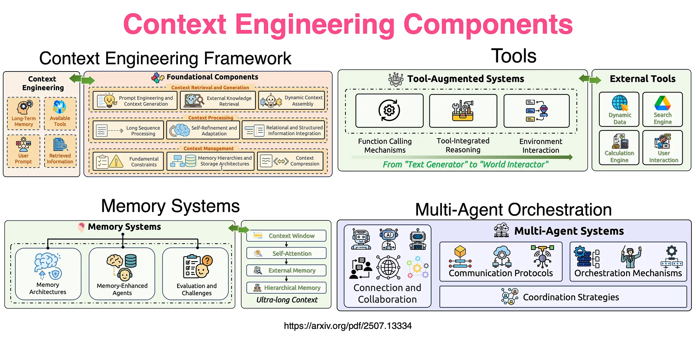

# Context Engineering — What Goes Into the Model's Brain


https://cobusgreyling.medium.com/context-engineering-a34fd80ccc26

## The Problem with Prompt Engineering Alone

You've mastered prompt engineering.

You write perfect system messages.

But now you face a real problem:

```
Context Window: 128,000 tokens

Your system prompt:         500 tokens
User's question:            100 tokens
Conversation history:       15,000 tokens
Retrieved documents:        80,000 tokens
Tool results:               20,000 tokens
Available for response:     12,400 tokens

Total needed:               115,600+ tokens
```

What if you have 500,000 tokens of relevant documents?

You can't fit them all.

**What do you include? What do you leave out?**

This is Context Engineering.

---

## What is Context Engineering?

> **Context Engineering is the discipline of deciding what information goes into the model's limited context window, in what order, and in what form — so the model produces the best possible output.**

Prompt Engineering = How you write one prompt.

Context Engineering = How you **assemble the entire input** from multiple sources.

```
Prompt Engineering:
    "Write a good system message"

Context Engineering:
    "Decide which 5 of 200 documents are relevant,
     summarize the conversation history,
     include the right tool results,
     structure everything so the model understands priority,
     and fit it all within the token budget"
```

---

## The Context Window is a Budget

Think of the context window like a suitcase with limited space.

```
┌─────────────────────────────────────────┐
│           CONTEXT WINDOW                 │
│           (128K tokens)                  │
│                                          │
│  ┌──────────────────────┐               │
│  │ System Instructions   │  500 tokens   │
│  ├──────────────────────┤               │
│  │ User Profile/Prefs    │  200 tokens   │
│  ├──────────────────────┤               │
│  │ Conversation History  │  5,000 tokens │
│  ├──────────────────────┤               │
│  │ Retrieved Knowledge   │  10,000 tokens│
│  ├──────────────────────┤               │
│  │ Tool Results          │  3,000 tokens │
│  ├──────────────────────┤               │
│  │ Current User Query    │  100 tokens   │
│  ├──────────────────────┤               │
│  │ Output Reserve        │  4,000 tokens │
│  └──────────────────────┘               │
│                                          │
│  Used: ~23,000 / 128,000                │
└─────────────────────────────────────────┘
```

Every token you waste on irrelevant information = a token you can't use for relevant information.

---

## The Components of Context

### 1. System Instructions

The foundation. Always present. Defines behavior.

```
Role: What the AI is
Rules: What it can and cannot do
Format: How to structure responses
Policy: Escalation rules, safety boundaries
```

Should be: Concise, stable, versioned.

### 2. User Context

Who is asking? What do they have access to?

```
User role: Senior Engineer
Team: Platform
Customer: Acme Corp (Customer ID: 12345)
Permissions: read-only access to production logs
Timezone: UTC-5
Previous interactions: Prefers code examples over prose
```

### 3. Conversation History

Past messages in this session.

Problem: Grows unboundedly!

```
Turn 1: "What's Kubernetes?"           (50 tokens)
Turn 2: [long explanation]              (500 tokens)
Turn 3: "How does networking work?"     (30 tokens)
Turn 4: [long explanation]              (800 tokens)
...
Turn 50: [???]                          (Running total: 40,000 tokens!)
```

Solutions:
- Sliding window (keep last N turns)
- Summarization (compress old turns)
- Selective retention (keep decisions, drop chatter)

### 4. Retrieved Knowledge (RAG)

Documents fetched based on the current query.

```
Query: "How to fix OOM errors in Kubernetes?"

Retrieved:
  Doc 1: K8s memory limits best practices (relevance: 0.92)
  Doc 2: Pod resource configuration guide (relevance: 0.88)
  Doc 3: OOM killer behavior in Linux (relevance: 0.85)
  Doc 4: Docker memory configuration (relevance: 0.71)  ← less relevant
  Doc 5: Kubernetes networking overview (relevance: 0.43) ← probably skip
```

Decisions:
- How many documents to include?
- Full documents or relevant chunks only?
- In what order?

### 5. Tool Results

Outputs from tools the model has called.

```
Tool: get_pod_status("web-server-pod")
Result: {
  "status": "CrashLoopBackOff",
  "restarts": 47,
  "last_error": "OOMKilled",
  "memory_limit": "256Mi",
  "memory_usage_at_crash": "255Mi"
}
```

### 6. Output Budget

You must reserve tokens for the response!

```
Context window:     128,000 tokens
Input uses:         120,000 tokens
Left for response:  8,000 tokens

If response needs 15,000 tokens... TRUNCATED!
```

Always plan your output budget.

---

## Context Assembly Strategies

### Strategy 1: Priority Stacking

Put the most important information first and last.

```
[System Instructions]    ← Always first (highest priority)
[Current Query]          ← Recent (high attention)
[Most Relevant Docs]     ← Closest match
[Tool Results]           ← Fresh data
[Conversation Summary]   ← Compressed history
[Less Relevant Context]  ← Might be ignored
```

Why? Models tend to pay most attention to the **beginning** and **end** of context (the "lost in the middle" problem).

### Strategy 2: Compression

Instead of raw history, compress it:

```
Raw (2000 tokens):
  User: "What's wrong with my deployment?"
  AI: [500 word explanation of CrashLoopBackOff]
  User: "I tried increasing memory"  
  AI: [400 word explanation of resource limits]
  User: "It's still crashing"
  AI: [300 word suggestion about memory leaks]

Compressed (200 tokens):
  Context: User has a pod in CrashLoopBackOff due to OOMKilled.
  Already tried: Increasing memory limit (still crashes).
  Suggested but not yet tried: Memory leak investigation with profiling tools.
  Current status: Issue unresolved.
```

Same information. 10x fewer tokens.

### Strategy 3: Dynamic Selection

Choose context based on the current query:

```
User asks about networking → Include network docs, skip storage docs
User asks about costs → Include pricing data, skip architecture docs
User asks to debug → Include error logs, skip marketing content
```

### Strategy 4: Structured Delimiters

Help the model understand what's what:

```
=== SYSTEM INSTRUCTIONS ===
You are a Kubernetes expert...

=== USER CONTEXT ===
Role: DevOps Engineer, Cluster: production-us-east-1

=== RELEVANT DOCUMENTATION ===
[Doc 1: Memory Management]
...

=== CONVERSATION SUMMARY ===
Previous discussion covered pod restart issues...

=== CURRENT QUESTION ===
Why is my pod still crashing after I increased the memory limit?
```

Clear sections prevent the model from confusing instructions with data.

---

## The "Lost in the Middle" Problem

Research shows: Models pay most attention to the beginning and end of context.

Information in the **middle** gets less attention.

```
Attention distribution:

Beginning: ████████████ HIGH
Middle:    ████         LOW  ← information here may be missed!
End:       ██████████   HIGH
```

Implications:
- Put critical instructions at the BEGINNING
- Put the current query at the END
- Don't bury important facts in the middle of long documents

---

## Context Engineering vs Prompt Engineering

```
┌─────────────────────────────────────────────────────────────┐
│                                                              │
│  Prompt Engineering                                          │
│  ─────────────────                                          │
│  "How do I write this one message well?"                    │
│                                                              │
│  Scope: Single message crafting                             │
│  Focus: Wording, structure, examples                        │
│  Scale: One prompt at a time                                │
│                                                              │
├─────────────────────────────────────────────────────────────┤
│                                                              │
│  Context Engineering                                         │
│  ──────────────────                                         │
│  "What information should the model have access to,         │
│   and how do I assemble it from many sources?"              │
│                                                              │
│  Scope: Entire context assembly pipeline                    │
│  Focus: Selection, compression, ordering, budgeting         │
│  Scale: System-level design                                 │
│                                                              │
└─────────────────────────────────────────────────────────────┘
```

---

## Real-World Example

A customer support AI that answers questions about their account:

```
Without Context Engineering:
  User: "Why was I charged twice?"
  AI: "I'd be happy to help! Could you provide your account number?"
  (Useless — the system should already KNOW who they are)

With Context Engineering:
  Context assembled:
    - User identity: John Smith, Account #12345
    - Last 3 transactions: $49.99 on June 1, $49.99 on June 3
    - Billing rules: Monthly subscription, charge date = 1st
    - Known issue: Duplicate charge bug affected 200 accounts on June 3
    
  User: "Why was I charged twice?"
  AI: "I can see your account was affected by a billing issue on June 3 
       that caused a duplicate $49.99 charge. This has been identified 
       and a refund will be processed within 3-5 business days. 
       Your next regular charge will be July 1st."
```

Same model. Same prompt engineering. But dramatically different quality because of **what context was assembled**.

---

## The Limitation of Context Engineering

Context Engineering solves WHAT goes into the model.

But it doesn't solve HOW the system is structured:

- How do you orchestrate multiple LLM calls?
- How do you manage state across turns?
- How do you handle errors and retries?
- How do you chain tools and knowledge together?

You need a **harness** — the engineering system that wraps around the model.

---

## Summary

```
Context Engineering = Deciding what information the model receives

Key aspects:
- Budget: Context window is finite, allocate wisely
- Selection: Choose most relevant information
- Compression: Summarize when possible
- Ordering: Beginning and end get most attention
- Structure: Clear delimiters between context types
- Dynamic: Different queries need different context

Components:
- System instructions (stable, versioned)
- User context (identity, permissions, preferences)
- Conversation history (compressed or windowed)
- Retrieved knowledge (relevant documents)
- Tool results (live data)
- Output budget (reserve space for response)
```

---

## Key Takeaways

1. The context window is a fixed budget — every token counts
2. Context Engineering decides WHAT enters the model from many sources
3. Information at the beginning and end gets most attention ("lost in the middle")
4. Compression turns 2000 tokens of history into 200 tokens of summary
5. Dynamic selection means different queries assemble different contexts
6. Clear structure (delimiters, sections) helps the model understand priority
7. Good context engineering makes the same model 10x more useful

---

## Next → [07-harness-engineering.md](./07-harness-engineering.md)

> The model is powerful. The context is well-assembled. But who ORCHESTRATES everything? Who decides when to call tools, when to retrieve documents, when to ask for clarification? The Harness is the engineering system that makes it all work together.
