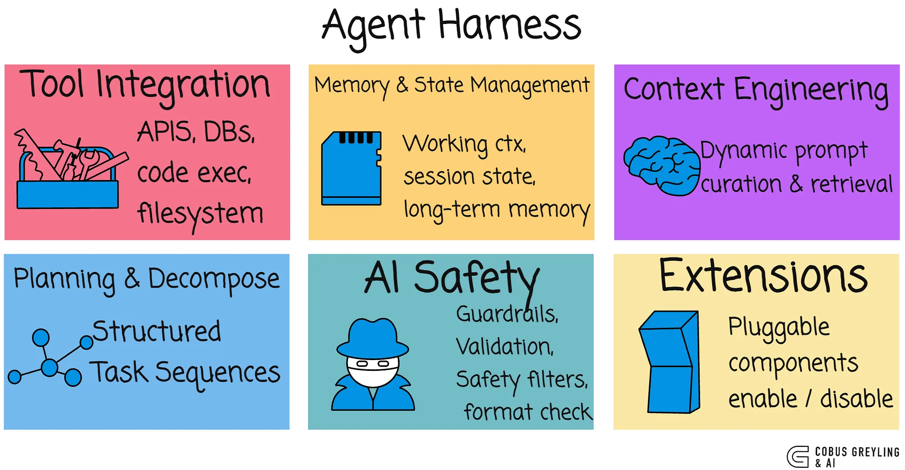

# Harness Engineering — The System That Wraps the Model


https://cobusgreyling.medium.com/the-rise-of-ai-harness-engineering-5f5220de393e

## The Problem

You have:
- A powerful LLM
- Good prompts (Prompt Engineering)
- Well-assembled context (Context Engineering)

But who **orchestrates** everything?

```
User asks a question
    → Who decides to search documents?
    → Who decides to call a tool?
    → Who validates the tool result?
    → Who handles errors?
    → Who formats the final response?
    → Who logs everything?
    → Who enforces security?
```

The LLM doesn't do any of this.

The **harness** does.

---

## What is a Harness?

> **A harness is the application code that wraps around an LLM — managing the flow of data, decisions, tool calls, error handling, security, and orchestration.**

The LLM is an engine.

The harness is the car around it.

```
Without harness:
    Engine sitting on the ground. Powerful but useless.

With harness:
    Steering wheel, brakes, fuel system, dashboard, safety features.
    Now you can actually drive somewhere.
```

---

## The Harness Architecture

```
┌─────────────────────────────────────────────────────┐
│                    HARNESS                            │
│                                                      │
│  ┌────────────┐                                     │
│  │ Input       │  ← User request arrives            │
│  │ Validation  │  ← Check format, auth, safety      │
│  └──────┬─────┘                                     │
│         │                                            │
│         ▼                                            │
│  ┌────────────┐                                     │
│  │ Context     │  ← Assemble: history, docs, user   │
│  │ Assembly    │     context, tool results           │
│  └──────┬─────┘                                     │
│         │                                            │
│         ▼                                            │
│  ┌────────────┐     ┌──────────┐                   │
│  │ LLM Call   │────→│ LLM API  │ (external)        │
│  │            │←────│          │                    │
│  └──────┬─────┘     └──────────┘                   │
│         │                                            │
│         ▼                                            │
│  ┌────────────┐                                     │
│  │ Response    │  ← Parse, validate, check schema   │
│  │ Processing  │  ← Handle tool calls               │
│  └──────┬─────┘                                     │
│         │                                            │
│         ├──→ Tool Call? → Execute → Back to LLM     │
│         │                                            │
│         ▼                                            │
│  ┌────────────┐                                     │
│  │ Output      │  ← Format, filter, log             │
│  │ Delivery    │  ← Return to user                  │
│  └─────────────┘                                    │
│                                                      │
│  ┌────────────────────────────────────────┐         │
│  │ Cross-cutting: Logging, Auth, Metrics,  │         │
│  │ Rate Limiting, Error Handling, Retries  │         │
│  └────────────────────────────────────────┘         │
└─────────────────────────────────────────────────────┘
```

---

## What the Harness Does (That the LLM Cannot)

### 1. Authentication and Authorization

The LLM doesn't know who's asking.

The harness does:

```python
def handle_request(request):
    # Harness responsibility
    user = authenticate(request.token)
    if not user.has_permission("ask_about_production"):
        return "Access denied"
    
    # Only then call the LLM
    response = call_llm(build_context(user, request))
```

### 2. Tool Execution

The LLM can REQUEST a tool call. It cannot EXECUTE one.

```
LLM says: "I want to call get_weather(city='London')"

Harness:
  1. Validates the tool name is allowed
  2. Validates parameters match schema
  3. Checks user has permission to use this tool
  4. Executes the function
  5. Validates the result
  6. Feeds result back to LLM
```

### 3. Error Handling

LLMs don't handle errors. They generate text.

```python
try:
    response = call_llm(prompt)
except TimeoutError:
    return "Service temporarily unavailable"
except RateLimitError:
    wait_and_retry()
except InvalidResponseError:
    retry_with_simpler_prompt()
```

### 4. Output Validation

The LLM might generate anything.

```python
response = call_llm(prompt)

# Harness validates
if not valid_json(response):
    retry()

if contains_pii(response):
    redact()

if response.confidence < 0.5:
    escalate_to_human()
```

### 5. Conversation State Management

LLMs are stateless. They don't remember previous calls.

The harness manages memory:

```python
class ConversationHarness:
    def __init__(self):
        self.history = []
        self.session_data = {}
    
    def process(self, user_message):
        self.history.append({"role": "user", "content": user_message})
        
        context = self.build_context()  # Includes history
        response = call_llm(context)
        
        self.history.append({"role": "assistant", "content": response})
        return response
```

### 6. Cost and Rate Control

```python
class HarnessWithLimits:
    def process(self, request):
        if self.user_token_budget_exceeded(request.user):
            return "Daily token limit reached"
        
        if self.concurrent_requests > MAX_CONCURRENT:
            return queue_request(request)
        
        response = call_llm(request)
        self.track_tokens_used(request.user, response.usage)
```

---

## Harness Patterns

### Pattern 1: Simple Request-Response

```
User → Harness → LLM → Harness → User
```

One call. No tools. No loops.

Good for: Simple Q&A, text generation, classification.

### Pattern 2: Tool Loop

```
User → Harness → LLM → "Call tool X" → Harness executes tool
                  ↑                              │
                  └────── Result back to LLM ────┘
                          
                  LLM → "Call tool Y" → Harness executes tool
                  ↑                              │
                  └────── Result back to LLM ────┘
                  
                  LLM → Final answer → Harness → User
```

The harness loops until the LLM says "I'm done."

Good for: Research tasks, data gathering, multi-step problems.

### Pattern 3: Pipeline

```
User → Harness Step 1 (classify intent)
                 │
                 ├── "billing" → LLM with billing context
                 ├── "technical" → LLM with tech context  
                 └── "general" → LLM with general context
                           │
                           ▼
                 Harness Step 2 (format and deliver)
```

Different LLM calls for different paths. The harness decides the route.

### Pattern 4: Guard Rails

```
User → Harness Input Guard → LLM → Harness Output Guard → User
         │                              │
         ├── Toxic input? Block.       ├── PII in output? Redact.
         ├── Injection? Sanitize.      ├── Hallucination? Flag.
         └── Off-topic? Redirect.      └── Schema invalid? Retry.
```

### Pattern 5: Human-in-the-Loop

```
User → Harness → LLM → "I recommend deleting the database"
                              │
                    Harness: HIGH RISK DETECTED
                              │
                              ▼
                    Hold. Ask human for approval.
                              │
                    Human: "Approved" / "Rejected"
                              │
                              ▼
                    Proceed or abort.
```

---

## Harness vs Framework vs Agent

People confuse these terms. Let's clarify:

```
┌──────────────────────────────────────────────────────┐
│ Harness                                               │
│ = Your application code that wraps and controls       │
│   the LLM. YOU write it. YOU own it.                 │
│                                                       │
│ Examples: Input validation, auth, retry logic,        │
│ tool execution, logging, state management             │
├──────────────────────────────────────────────────────┤
│ Framework                                             │
│ = Library that provides harness building blocks.      │
│ Someone ELSE wrote it. You configure and extend it.   │
│                                                       │
│ Examples: LangChain, LlamaIndex, Strands SDK          │
├──────────────────────────────────────────────────────┤
│ Agent                                                 │
│ = A harness where the LLM decides the control flow.  │
│ The LLM chooses which tools to call and when to stop.│
│                                                       │
│ Examples: Auto-GPT, ChatGPT with plugins, custom      │
│ agent loops                                           │
└──────────────────────────────────────────────────────┘
```

An agent IS a harness. But not all harnesses are agents.

A simple Q&A app has a harness (input → LLM → output) but no agency.

---

## Building a Production Harness

### The Minimum Viable Harness

```python
def simple_harness(user_input):
    # 1. Validate input
    if not user_input.strip():
        return "Please provide a question."
    
    # 2. Build context
    system_prompt = load_system_prompt()
    messages = [
        {"role": "system", "content": system_prompt},
        {"role": "user", "content": user_input}
    ]
    
    # 3. Call LLM
    response = llm_client.chat(messages)
    
    # 4. Return
    return response.content
```

### The Production Harness

```python
def production_harness(request):
    # 1. Authenticate
    user = authenticate(request)
    
    # 2. Rate limit
    check_rate_limit(user)
    
    # 3. Input safety
    if is_harmful(request.message):
        return safe_refusal()
    
    # 4. Assemble context
    context = ContextBuilder()
    context.add_system_prompt(get_versioned_prompt("v2.3"))
    context.add_user_profile(user)
    context.add_history(get_session_history(request.session_id))
    context.add_retrieved_docs(search(request.message, user.permissions))
    context.add_user_message(request.message)
    context.enforce_token_budget(max_tokens=100000)
    
    # 5. Call LLM with retry
    response = retry_with_backoff(
        lambda: llm_client.chat(context.build()),
        max_retries=3,
        timeout=30
    )
    
    # 6. Handle tool calls
    while response.has_tool_calls:
        for tool_call in response.tool_calls:
            result = execute_tool(tool_call, user.permissions)
            context.add_tool_result(tool_call.id, result)
        response = llm_client.chat(context.build())
    
    # 7. Validate output
    output = validate_output(response, expected_schema)
    
    # 8. Safety check output
    output = redact_pii(output)
    
    # 9. Log everything
    log_interaction(request, context, response, user)
    
    # 10. Track costs
    track_token_usage(user, response.usage)
    
    return output
```

---

## Why "Harness Engineering" is a Real Discipline

Most AI failures are NOT model failures.

They are harness failures.

```
"The AI hallucinated"
→ Harness didn't provide relevant context (Context Engineering failure)

"The AI exposed private data"  
→ Harness didn't filter by permissions (Auth failure)

"The AI ran an unsafe command"
→ Harness didn't validate tool calls (Execution failure)

"The AI costs too much"
→ Harness didn't enforce budgets (Cost control failure)

"The AI is inconsistent"
→ Harness doesn't version prompts (Configuration failure)
```

The model is often fine. The harness is where production breaks.

---

## Summary

```
Harness Engineering = Building the system around the LLM

The LLM is the brain.
The harness is the body.

The harness handles:
- Authentication and authorization
- Input validation and safety
- Context assembly
- LLM call management (retries, timeouts, fallbacks)
- Tool call execution and validation
- Output validation and safety
- State and conversation management
- Logging, metrics, and observability
- Cost tracking and rate limiting
- Human escalation paths
```

---

## Key Takeaways

1. The LLM is stateless and has no agency — the harness provides both
2. Tool execution happens in the harness, not in the model
3. Most production AI failures are harness failures, not model failures
4. A harness can be simple (request → LLM → response) or complex (multi-step loops with tools)
5. Frameworks like LangChain provide harness building blocks
6. Agents are harnesses where the LLM controls the flow
7. Production harnesses need auth, validation, retries, logging, cost control, and safety checks

---

## Next → [12-agentic-frameworks.md](./12-agentic-frameworks.md)

> The LLM can think but it can't ACT. It can't check the weather, query a database, or send an email. Tool Calling gives the model hands — allowing it to interact with the real world through controlled function execution.
