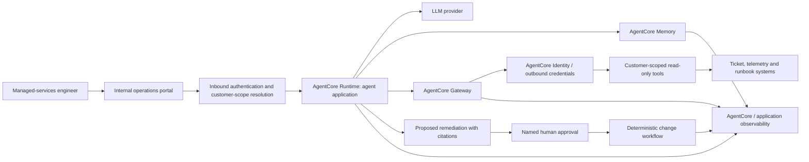
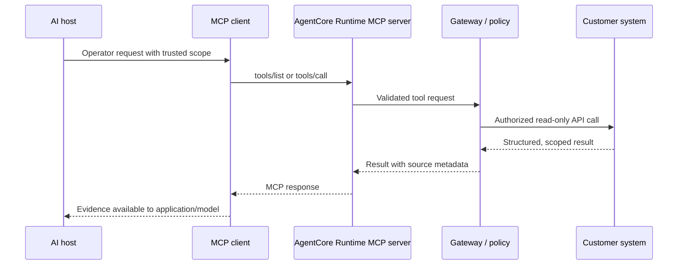

# Amazon Bedrock AgentCore: From Agent Prototype to Managed Production Service

## Learning objectives

By the end of this tutorial, you will be able to:

- Explain which parts of an agent system AgentCore provides and which remain your responsibility.
- Design a customer-scoped operations agent with explicit identity, tool, memory, and approval boundaries.
- Choose when to use AgentCore Runtime, Gateway, Identity, Memory, and Observability.
- Recognize the operational controls required before an agent can affect a managed customer environment.

## Where this fits in the AI journey

An LLM generates text. Tool calling lets an application obtain live data or take controlled actions. RAG supplies private knowledge. Agent frameworks coordinate state, tools, and loops. An **agentic AI platform** provides production infrastructure around that application: hosting, identity, connectivity, memory, and observability.

Amazon Bedrock AgentCore is an AWS service family for those platform concerns. It can work with agent code written in frameworks such as Strands, LangGraph, and CrewAI, or with custom code, and it can work with different model providers. It does not write the agent logic, define customer authorization, or make an unsafe tool safe. Those remain application and operating-model responsibilities.

## 1. The production problem

Imagine a managed-services engineer handling a customer deployment incident. An assistant should be able to:

1. Verify who is asking and which customer environment they may access.
2. Retrieve customer-scoped tickets, logs, and approved runbooks.
3. Reason over the evidence and state its uncertainty.
4. Propose a remediation, but require an authorized human before any change.
5. Record an end-to-end audit trail for investigation and compliance.

A notebook prototype can demonstrate the reasoning. It usually does not solve session isolation, workload identity, outbound credentials, secure tool access, durable memory, operational telemetry, or deployment lifecycle. Those are the gaps a platform layer addresses.

## 2. AgentCore building blocks

| Building block | Primary responsibility | What you still own |
|---|---|---|
| Runtime | Serverless hosting and invocation environment for agent or tool code. | Agent loop, dependencies, code security, input/output validation. |
| Identity | Workload identity, authentication, authorization, and credential management patterns for agents. | Customer authorization model, IdP configuration, least-privilege policy. |
| Gateway | Governed connection to tools and resources. | Tool contracts, downstream business authorization, safe side-effect policy. |
| Memory | Managed memory capabilities for agent applications. | What may be remembered, retention, tenant isolation, and deletion processes. |
| Built-in tools | Managed capabilities such as code interpretation or browser interaction where configured/supported. | Use-case approval, data protection, egress policy, output verification. |
| Observability | Metrics, traces, and log integration for AgentCore resources. | Telemetry design, redaction, retention, alerts, runbooks, and evaluations. |

The components are composable. A simple read-only assistant may need Runtime plus observability. A customer-facing operations agent is more likely to need all of the control points above.

## 3. Reference architecture: customer operations agent



### Request and data flow

1. The operations portal authenticates the engineer and resolves customer/account assignment from authoritative identity and ticket data.
2. The portal invokes the agent with a scoped request; it does not let a user-supplied prompt choose the customer boundary.
3. Runtime runs the application code. The application constructs model context from the request and from authorized evidence.
4. If the agent needs evidence, it requests a narrow, read-only tool through Gateway. The tool call includes only the minimal parameters required.
5. Gateway and the downstream service apply outbound identity and authorization. The ticket or telemetry system independently verifies the customer scope.
6. The agent receives structured evidence, drafts a cited diagnosis, and records uncertainty if data is incomplete or contradictory.
7. A remediation is a proposal. A separately authorized human approval starts a deterministic workflow with its own tightly scoped execution identity.
8. Correlated telemetry links the portal request, runtime session, model invocation, tool calls, approval decision, and workflow outcome.

### Security boundaries

- **User boundary:** an operator is authenticated before the agent is invoked.
- **Customer boundary:** every retrieval and tool request is filtered and rechecked by the authoritative downstream system.
- **Model boundary:** user input and retrieved text are untrusted data; neither is policy.
- **Action boundary:** the agent cannot execute a change merely because it generated a recommendation.
- **Telemetry boundary:** logs must support audit and debugging without storing secrets or unnecessary customer content.

## 4. Runtime: hosting code, not replacing architecture

AgentCore Runtime is a serverless, purpose-built environment for hosting agent or tool code. AWS documents framework flexibility, model flexibility, and protocol support including MCP and A2A. Your agent still owns the orchestration loop: prompt assembly, model invocation, retries, state machine, tool-selection policy, and response validation.

For an invocation, define an explicit contract. Keep the customer scope and authenticated subject in trusted request metadata, rather than asking the model to infer them from conversation text.

```python
def handle_incident(request, trusted_context):
    scope = authorize(trusted_context.subject, request.incident_id)
    evidence = get_deployment_events(scope.customer_id, request.deployment_id)
    result = model_generate(
        instructions=INCIDENT_POLICY,
        user_request=request.question,
        evidence=evidence,
        output_schema=IncidentBrief,
    )
    return validate_and_cite(result, evidence)
```

The important controls are `authorize`, the read-only evidence function, and `validate_and_cite`; the model call is only one part of the system.

### Deployment choices

AgentCore Runtime supports deployment approaches documented by AWS, including direct code deployment and container-image deployment. Direct deployment reduces runtime-environment management, while container deployment gives you more packaging control. In either case, scan and patch dependencies, pin build inputs, test in a non-production environment, and promote immutable artifacts through a controlled release process.

The shared-responsibility boundary changes by deployment mode. AWS documents that it manages language-runtime updates for direct deployments, while you remain responsible for agent code and dependencies. With containers, you must also rebuild and redeploy your image as appropriate when upstream image/dependency vulnerabilities are addressed.

## 5. Sessions, state, and memory

A runtime session is not a data-governance strategy. Use sessions for interaction continuity and application state only within clearly defined boundaries. Define:

- Session owner and customer identifier.
- Maximum lifetime and inactivity behavior.
- Which state is ephemeral versus durable.
- Whether a human can inspect, correct, or terminate a run.
- How state is cleaned up when customer access changes.

AgentCore Memory is useful when an agent needs managed recall beyond a single prompt. Before enabling it, decide what is allowed to persist. Operational facts can become stale; user preferences can become sensitive; incident evidence can be customer confidential. Prefer storing references, summaries, and policy-approved facts over unrestricted raw transcripts. Make retention, deletion, access review, and cross-tenant tests part of the design.

## 6. Gateway and tools: make capability boundaries explicit

Gateway can provide a governed integration point for tools and resources. That helps centralize connectivity, policies, credentials, and observability, but it should not become a “superuser adapter.” Define small tools with typed parameters and bounded effects.

```json
{
  "name": "get_deployment_events",
  "purpose": "Read customer-scoped deployment events for diagnosis.",
  "input": {"incident_id": "string", "deployment_id": "string"},
  "effect": "read-only",
  "reject_if": ["caller is not assigned", "incident/customer mismatch"]
}
```

### Tool design rules

- Return structured, minimal data with source IDs and timestamps.
- Validate every parameter; never execute shell or query language supplied by the model.
- Apply authorization at the tool and downstream API, not in a prompt.
- Set deadlines, rate limits, idempotency, and concurrency limits.
- Separate `propose_change` from `execute_change`; only the latter should enter a controlled workflow after approval.
- Treat tool descriptions and tool output as possible prompt-injection carriers.

## 7. Identity: inbound and outbound are different problems

**Inbound identity** answers: “Who is invoking this agent, and may they access this customer/incident?” **Outbound identity** answers: “What credentials may this agent/tool use when calling a downstream system on behalf of that request?”

AgentCore Identity is designed for agent workload identity and credential-management scenarios. Use it alongside—not instead of—your enterprise identity provider, IAM policies, customer authorization service, and downstream authorization checks.

Avoid a common failure mode: giving the agent runtime a broad role that can read every customer account, then relying on the prompt to request only the right one. Instead, use narrow, auditable identity propagation or token exchange; enforce policy as close as possible to the protected resource; and ensure an operator cannot escalate scope through a prompt or tool argument.

## 8. MCP on AgentCore Runtime

MCP is a protocol for connecting AI applications to tools, resources, and prompts. AgentCore Runtime can host MCP servers. AWS documents a Streamable HTTP setup in which an MCP server is exposed at `0.0.0.0:8000/mcp`; it supports stateless and stateful configurations depending on the MCP features needed.



MCP simplifies interoperability; it does not grant safe access by itself. Allowlist servers, review server code and tool metadata, authenticate remote clients, limit egress, and preserve the user/customer context through to the downstream API. If the server supports stateful interaction, define session isolation and lifecycle explicitly.

## 9. Built-in browser and code capabilities

Browser and code-execution capabilities can help an agent navigate a web workflow or analyze data. They also introduce high-risk paths: web content can contain prompt injection, browser actions can have side effects, and code may expose data or consume resources.

Use these capabilities only for approved workflows. Start with read-only, sandboxed tasks; restrict egress and accessible domains/data; set time and resource budgets; require a human confirmation before external submissions or changes; and log the action intent and outcome. Verify final outputs independently—generated code or web-derived text is not authoritative merely because it executed.

## 10. Observability and evaluation

Production agents need more than application-error logs. AgentCore supports observability integration for runtime and other resource types, with CloudWatch as a source of service data. Configure destinations, access, retention, and redaction deliberately; some resource logs require explicit configuration.

Capture correlated telemetry for:

| Signal | Why it matters |
|---|---|
| Request, session, and customer-scope reference | Reconstruct a run without dumping sensitive payloads. |
| Model/version and prompt policy version | Explain behavioral changes and support rollback. |
| Tool selection, parameters (redacted), latency, result status | Detect unsafe loops, failures, and overuse. |
| Approval decision and executing identity | Provide change-management evidence. |
| Retrieval sources and citation coverage | Investigate unsupported or stale answers. |
| Token/cost, latency, error, refusal, and escalation metrics | Operate capacity, budget, and quality. |

Evaluation is separate from observability. Create a versioned test set of sanitized operational scenarios: valid incident analysis, insufficient evidence, cross-customer request, malicious retrieved instruction, unavailable tool, and rejected change. Evaluate groundedness, correct escalation, authorization behavior, tool-call correctness, latency, and cost on every material change.

## 11. Failure handling

| Failure | Expected behavior |
|---|---|
| Customer scope cannot be established | Stop; request authorized context. |
| Evidence tool times out | Report missing evidence; do not fabricate a diagnosis. |
| Tool output conflicts with another source | Surface the conflict and escalate. |
| Model output fails schema/policy validation | Retry only within a small budget or return a safe failure. |
| Approval is absent or expired | Do not execute the change. |
| Session or dependency fails | Preserve minimal run state, emit an alert, and follow normal incident procedures. |

An agent should fail closed around data access and side effects, and fail transparently around answer generation.

## 12. Hands-on design exercise

Design an “incident brief” agent for one customer account.

1. List the exact read-only tools it needs. Remove any tool that is not necessary.
2. For each tool, identify caller identity, downstream identity, customer-scope check, returned fields, timeout, and audit event.
3. Define the model output schema: summary, evidence references, uncertainty, recommended next action, and escalation flag.
4. Identify the only action that requires approval. Implement it as a deterministic workflow, not an agent tool.
5. Write five adversarial tests: cross-customer access, prompt injection in a ticket, stale runbook, failed retrieval, and an attempt to force a rollback.

## Key takeaways

- AgentCore provides infrastructure capabilities; your code still owns agent logic and business controls.
- The critical design work is customer-scoped authorization, narrow tools, controlled actions, and evidence-based outputs.
- Runtime sessions and managed memory must be governed as data stores.
- Gateway and MCP improve integration, but downstream authorization remains mandatory.
- Observability plus evaluation turns an agent from a demo into an operable service.

## Glossary

- **Agent loop:** The repeated process of interpreting a goal, selecting tools, observing results, and deciding whether to continue.
- **Gateway:** A controlled integration point between an agent and external tools/resources.
- **Inbound identity:** Identity used to authenticate and authorize the caller of an agent.
- **Outbound identity:** Credential/identity used by an agent or tool to call another system.
- **MCP:** Model Context Protocol, an open protocol for AI application integrations.
- **RAG:** Retrieval-Augmented Generation, where retrieved evidence is provided to a model at request time.
- **Session:** A bounded interaction context, distinct from long-term memory and durable business records.

## Production readiness checklist

- [ ] The customer/account boundary is resolved from trusted data and rechecked by downstream systems.
- [ ] Agent, tool, approval, and workflow identities use separate least-privilege permissions.
- [ ] Tools have typed contracts, input validation, timeouts, retries, idempotency, and audit events.
- [ ] All consequential actions are executed only by approved deterministic workflows.
- [ ] Prompt/model/tool versions and evaluation results are tracked with deployments.
- [ ] Memory, logs, traces, and caches have data classification, retention, access, and deletion controls.
- [ ] Alerts cover failed invocations, unsafe tool patterns, cost anomalies, and quality regressions.
- [ ] A human can inspect, stop, and take over an active operational workflow.

## Further reading

- [AWS: Host agents or tools with AgentCore Runtime](https://docs.aws.amazon.com/bedrock-agentcore/latest/devguide/agents-tools-runtime.html)
- [AWS: AgentCore Runtime versus harness](https://docs.aws.amazon.com/bedrock-agentcore/latest/devguide/harness-vs-runtime.html)
- [AWS: AgentCore Identity](https://docs.aws.amazon.com/bedrock-agentcore/latest/devguide/identity.html)
- [AWS: Deploy MCP servers in AgentCore Runtime](https://docs.aws.amazon.com/bedrock-agentcore/latest/devguide/runtime-mcp.html)
- [AWS: Configure AgentCore observability](https://docs.aws.amazon.com/bedrock-agentcore/latest/devguide/observability-configure.html)
- [Reference inspiration: AWS Bedrock AgentCore Deep Dive](https://joudwawad.medium.com/aws-bedrock-agentcore-deep-dive-6822e4071774)
