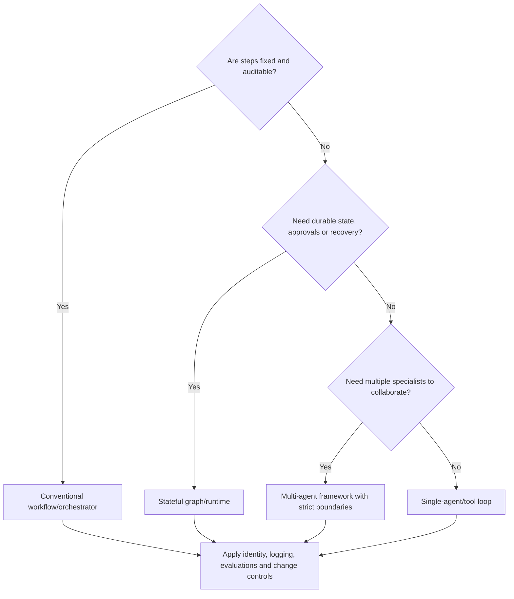
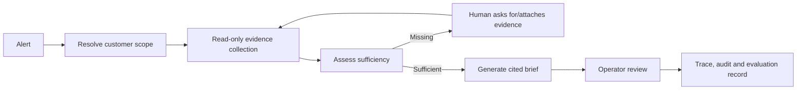

# Selecting Agentic AI Frameworks for Managed-Service Workloads

## What you will learn

How LangChain, LangGraph, CrewAI, AutoGen, and Strands differ, and when a conventional workflow is the better operational choice.

## Start with the workload, not the framework

An agent framework supplies abstractions for models, tools, state, orchestration, and often observability. It does not supply a customer-isolation model, correct operational policy, or reliable business process by itself. For managed services, choose the smallest mechanism that gives you the required flexibility and control.

## Comparison

| Framework | Primary idea | Strong fit | Watch-outs |
|---|---|---|---|
| LangChain | High-level agent/application abstractions and broad integrations. | Rapid model/tool prototypes and standard agent loops. | Abstractions can hide control flow; establish evaluation and tracing early. |
| LangGraph | Low-level stateful graph orchestration. | Long-running, resumable, approval-driven or mixed deterministic/agentic flows. | More explicit design work; graph/state versioning is an engineering responsibility. |
| CrewAI | Role-based crews plus structured flows. | Collaborative task decomposition and business automation prototypes. | Multi-agent role play can add cost, latency, and failure paths; use flows for control. |
| AutoGen | Conversational and event-driven multi-agent building blocks. | Distributed or asynchronous agent systems and research into collaboration patterns. | Requires careful runtime, message, supervision, and lifecycle design. |
| Strands | SDK focused on model-driven agents, tools, state, and multi-agent patterns. | Teams wanting Python/TypeScript agents, model-provider flexibility, and telemetry integration. | Tools run with host-process permissions; isolate and review them rigorously. |

All capabilities evolve quickly. Verify current compatibility, deployment options, and API behavior in each project’s official documentation before committing to an architecture.

## What the framework does not replace

Regardless of framework, externalize these controls:

- Authentication, tenant/customer authorization, and separation of duties.
- Typed tool contracts, idempotency, timeouts, rate limits, and approval gates.
- Durable business records and a deterministic executor for impactful changes.
- Secrets management, network policy, encryption, and software supply-chain controls.
- Traces linking model requests, tool calls, approvals, and customer-facing outcomes.

## Example 1: deterministic change-evidence workflow

Requirement: collect deployment evidence, validate fields, store an audit package, and open a review ticket. The steps and failure handling are fixed. Use a standard workflow/orchestrator and ordinary services; add an LLM only for optional summarization after evidence collection. This is easier to test, replay, approve, and audit than an autonomous agent.

## Example 2: stateful customer-operations research

Requirement: investigate an unfamiliar alert by selecting from approved read-only sources, compare evidence, and produce a cited investigation brief. This benefits from a stateful graph or carefully bounded agent loop: it may take different investigation branches, pause for an operator, and resume with new evidence. LangGraph is a strong conceptual fit when durable graph state and human interruption are primary needs; AutoGen or Strands can fit event-driven/multi-agent requirements; LangChain can fit a simpler single-agent starting point.

The state should contain opaque references to governed evidence where possible, not unrestricted customer data copied into every agent message. Each node/tool runs with only the permissions it needs. A review decision is a first-class event, not an informal chat response.

## Deployment and operations

Run short, stateless invocations in a serverless or container platform; place durable state in a managed store; use queues for backpressure; and use a workflow engine for long-running, retryable, or approval-based work. Kubernetes is appropriate when its operational capabilities are needed, not because agents require it. On AWS, Lambda, ECS/Fargate, EKS, Step Functions, queues, and managed databases are examples of these platform roles—select them according to existing operating standards.

Instrument request IDs, customer scope (minimized), framework state transitions, prompt/model versions, tool schemas/calls, approval events, token use, latency, failures, and evaluation scores. Build regression suites from real but sanitized operational scenarios before broad rollout.

## Selection rubric

| Question | Bias |
|---|---|
| Is the flow known, high impact, and compliance-sensitive? | Deterministic workflow first. |
| Does work pause, resume, branch, or require operator intervention? | Stateful graph/runtime. |
| Is collaboration essential rather than decorative? | Multi-agent framework, with explicit handoffs. |
| Do you need broad provider/tool integrations quickly? | High-level framework such as LangChain. |
| Do you need distributed, event-driven agent messaging? | Evaluate AutoGen Core. |
| Do you want a model-driven SDK with Python/TypeScript and tool/MCP support? | Evaluate Strands. |

## Key takeaways

- Framework selection follows workflow determinism, state, safety, and operating maturity.
- Most managed-service actions should remain conventional workflows with AI assisting interpretation.
- A multi-agent design is justified only when specialization and handoff outweigh extra complexity.

## Production readiness checklist

- [ ] A non-agent alternative was evaluated for each workflow.
- [ ] State, retries, timeout, and replay behavior are documented.
- [ ] Tool permissions and human approval gates are independently enforced.
- [ ] The deployment has tracing, evaluation, cost limits, and incident ownership.
- [ ] Framework/API versions are pinned, reviewed, and tested during upgrades.

## Further reading

- [LangChain overview](https://docs.langchain.com/oss/python/langchain/overview)
- [LangGraph overview](https://docs.langchain.com/oss/python/langgraph/overview)
- [CrewAI documentation](https://docs.crewai.com/)
- [AutoGen Core](https://microsoft.github.io/autogen/stable/user-guide/core-user-guide/index.html)
- [Strands Agents overview](https://strandsagents.com/docs/user-guide/quickstart/overview/)
