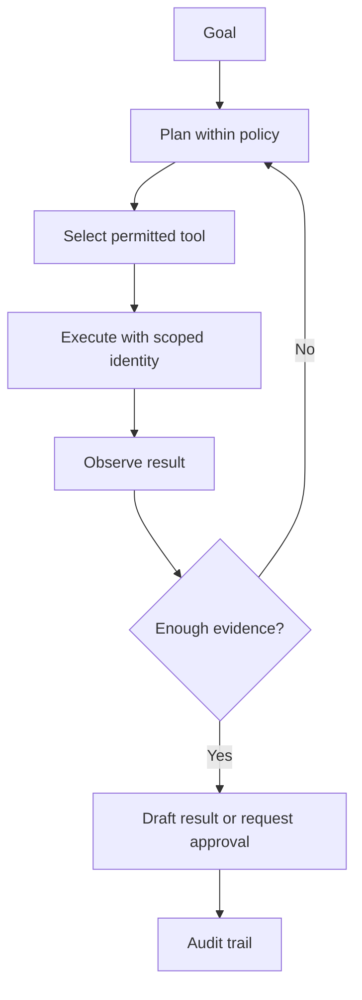
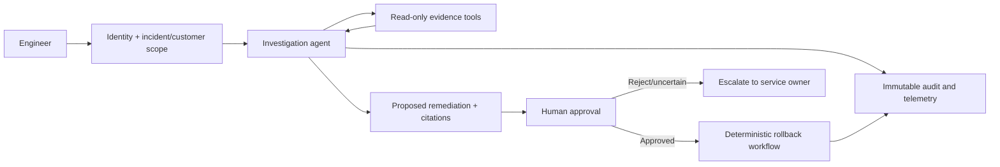

# AI Agents for Managed Operations

## What you will learn

When an agent is warranted, how tool use changes the risk model, and how to make operational automation observable and reversible.

## Chatbot versus agent

A chat application produces a response from supplied context. An **agent** can select from tools, observe their results, and continue toward an objective. That added loop is useful for bounded investigation or orchestration; it is unnecessary for deterministic tasks that ordinary code or a workflow engine can perform more safely.



The agent loop must have a maximum step count, token/time budget, termination rules, and an explicit escalation path. Every tool call must be independently authorized; no prompt should grant authority.

## Tools are typed contracts

A tool definition declares a name, purpose, input schema, output shape, and allowed side effects. The model may propose a call, but a tool gateway validates it before execution.

```json
{
  "name": "get_deployment_events",
  "input": {"customer_id": "string", "deployment_id": "string"},
  "constraints": "read-only; caller must be assigned to customer"
}
```

Production tool controls include input validation, allowlists, per-call authorization, idempotency keys, deadlines, rate limits, retry classification, and structured audit events. Write tools that do one narrow thing; avoid a generic “run command” capability.

## Deterministic workflow or agent?

Use deterministic orchestration when steps, approvals, and outcomes are known: ticket creation, evidence collection, remediation rollout, and notification. Use an agent only where interpretation or selection among bounded options adds value. A safe pattern is **agent proposes; workflow executes after approval**.

## Example: deployment investigation agent

Scenario: a customer deployment failed. The agent may read customer-scoped deployment events, known-error articles, and approved read-only metrics. It may propose a rollback, but cannot invoke one.



1. Scope is established from the ticket and operator assignment, not from model text.
2. Read-only tools return minimal evidence, tagged with source and timestamp.
3. The agent creates a proposal with uncertainty and source references.
4. A named human approver evaluates the proposal under change controls.
5. The deterministic workflow performs the approved change with its own least-privilege identity and records the result.

Failure handling: failed reads are reported as missing evidence; repeated calls are capped; ambiguous customer scope stops the run; failed rollback execution enters the existing incident process. Trace the agent decision, each tool call, approval identity, workflow run, latency, and cost.

## Security model

- Treat user input, retrieved documents, and tool responses as possible prompt-injection carriers.
- Separate read, propose, approve, and execute permissions. Do not reuse a highly privileged service role for the agent.
- Use short-lived credentials and secret references rather than placing secrets in prompts or tool outputs.
- Enforce tenancy and data residency at the data/tool layer; labels in a prompt are insufficient.
- Require human approval for consequential changes, financial effects, customer communications, and irreversible actions.

## Key takeaways

- An agent is an orchestrated tool-use loop, not simply a chat model with a longer prompt.
- The safest operational design limits tool scope and keeps execution deterministic.
- Identity, authorization, auditability, and approval are application controls outside the model.

## Production readiness checklist

- [ ] Each tool has a narrow schema, timeout, authorization check, and audit record.
- [ ] Step, cost, time, and retry budgets are enforced.
- [ ] High-impact actions require a human and a deterministic executor.
- [ ] Tenant/customer scope is carried and checked end to end.
- [ ] Agent runs have traces, evaluation cases, and incident playbooks.

## Further reading

- [Strands Agents: tool security](https://strandsagents.com/docs/user-guide/concepts/tools/)
- [LangGraph overview](https://docs.langchain.com/oss/python/langgraph/overview)
