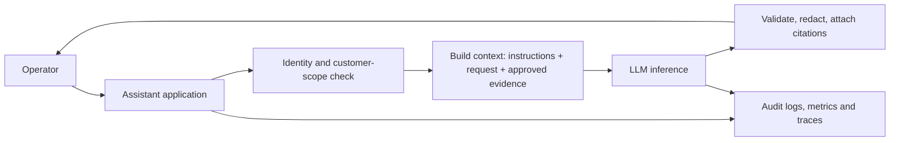

# Generative AI for AWS Managed Services Professionals

## What you will learn

How an LLM-backed application turns an operator request into an answer, which runtime controls matter, and how to operate it safely around customer environments.

## The production problem

An incident engineer needs a concise explanation of a deployment failure. A generative-AI assistant can summarize approved evidence and draft a response, but it must not invent facts, cross customer boundaries, or execute a change. The model is a probabilistic text engine—not an authority, a database, or an automation system.

## What happens in a chat request

An LLM turns text into **tokens**, maps token sequences into numerical representations, and repeatedly estimates the next token. The application assembles the input: instructions, the operator request, permitted history, and trusted evidence. The output is then validated before it is shown or used.



1. The operator authenticates; the application resolves their role and customer/account scope.
2. The application selects only evidence the operator may see and constructs the prompt.
3. The model generates candidate tokens. It does not independently read logs, tickets, or customer data.
4. Application code checks the response format, removes unsafe content if required, and presents citations.
5. Audit events record the request identity, sources used, model/version, latency, token use, and outcome—while avoiding unnecessary sensitive prompt retention.

The main security boundary is before context construction: retrieval and tool permissions must be evaluated with the caller’s identity, not the assistant service’s broad identity. Treat model output as untrusted until policy and schema checks pass.

## Messages and prompts

Most chat APIs accept role-labelled messages. A system/developer instruction defines application behavior, while a user message carries the request. Some APIs also represent assistant and tool-result messages. Exact role names and precedence differ by provider, so enforce policy in application code as well as in prompts.

A **prompt** is an interface contract. A production prompt defines scope, desired format, evidence rules, refusal behavior, and escalation. It is not a security boundary.

```text
Weak: Explain why the deployment failed.

Better: Using only the attached, customer-scoped deployment events, return JSON with
{summary, evidence[], confidence, recommended_next_step}. If evidence is insufficient,
say so and request the specific missing signal. Do not recommend execution of changes.
```

Use schema validation after generation. A valid JSON shape does not prove that its contents are correct.

## Context-window engineering

The context window is the finite token budget shared by instructions, user request, history, retrieved evidence, tool results, and model output. Budget it deliberately:

| Content | Operational rule |
|---|---|
| Policy/instructions | Keep stable, versioned, and concise. |
| Conversation history | Retain decision-relevant turns; summarize older ones. |
| Evidence | Retrieve only authorized, relevant, dated sources. |
| Output reserve | Reserve enough tokens for a usable answer or structured result. |

More context is not automatically better. Irrelevant logs can distract the model, increase cost/latency, and expose data. Prefer source filtering and summaries over prompt stuffing.

## Sampling and output controls

| Control | Meaning | Managed-services use |
|---|---|---|
| Temperature | Broadly adjusts randomness in token selection. | Use low values for extraction, summaries, and runbook drafts. |
| Top-k | Limits selection to the k highest-probability candidates. | Provider-specific; test instead of assuming a universal effect. |
| Top-p | Selects from the smallest probability mass reaching p. | Useful creative diversity control; avoid relying on it for correctness. |
| Max output tokens | Caps completion length. | Prevents runaway answers and helps latency budgets. |
| Stop sequences | End markers supported by some APIs. | Useful for controlled templates; validate anyway. |

Sampling settings influence style and variability, not truthfulness. For repeatable operational tasks, use a low-variance configuration, structured output, fixed prompt versions, evaluation tests, and explicit source grounding. A seed can improve reproducibility where a provider supports it, but it is not a guarantee across model or platform changes.

## Reliability, security, and operations

- Use streaming when time-to-first-token matters, but validate the completed result before allowing any downstream action.
- Set request timeouts, bounded retries, circuit breakers, concurrency limits, and a graceful fallback such as “evidence summary unavailable.”
- Defend against prompt injection: external text is data, never authority. Delimit it, label it as untrusted, restrict tools, and require policy checks outside the model.
- Keep customer data isolated in retrieval, logs, caches, and evaluation datasets. Encrypt data, use least privilege, and make retention intentional.
- Measure grounded-answer quality, schema-valid rate, refusal/escalation rate, latency percentiles, token cost, and operator acceptance—not just model availability.

## Managed-services example: incident support copilot

An engineer asks for an incident summary. The application verifies the incident’s customer identifier, retrieves read-only approved ticket and telemetry excerpts, and asks the model for a cited summary. If evidence conflicts or is insufficient, the expected response is an escalation, not a confident diagnosis. A human remains responsible for decisions and customer communication.

## Key takeaways

- An LLM predicts text; the surrounding application provides identity, evidence, policy, and control.
- Prompts guide behavior but do not replace authorization or validation.
- Context is a governed budget, and sampling controls do not make output factual.

## Production readiness checklist

- [ ] Customer-scoped authorization is enforced before retrieval.
- [ ] Prompts, models, schemas, and evaluations are versioned.
- [ ] Outputs are validated and cited where evidence is required.
- [ ] Logs and traces support investigation without retaining excessive sensitive content.
- [ ] Unsafe or uncertain cases have a human escalation path.

## Further reading

- [Amazon Bedrock Knowledge Bases](https://docs.aws.amazon.com/bedrock/latest/userguide/knowledge-base.html)
- [AWS guidance on prompt-injection defenses](https://docs.aws.amazon.com/prescriptive-guidance/latest/llm-prompt-engineering-best-practices/)
