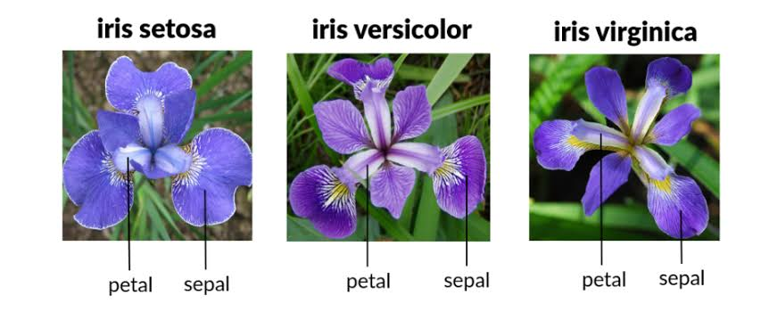
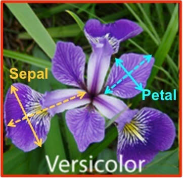
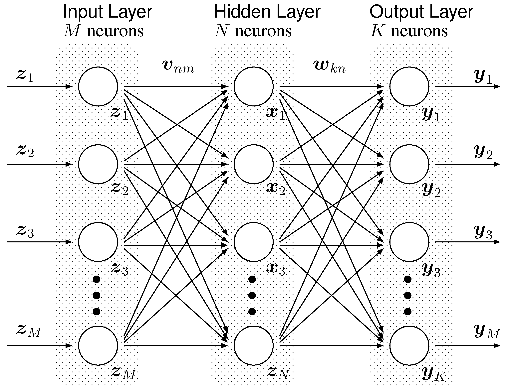

# The model learned the pattern

sounds almost magical.

The real question is:

> **Where is this pattern stored?**

Let's build it from scratch.

---

# Imagine you are teaching a child

Suppose you show a child hundreds of fruits.

```
🍎 Apple
🍎 Apple
🍎 Apple
🍌 Banana
🍌 Banana
🍊 Orange
```

After many examples you ask

```
This fruit...
Round
Red
Small stem

What is it?
```

The child says

```
Apple
```

Now ask yourself:

**Did the child memorize every apple?**

No.

The child's brain has created an internal representation.

Something like

```
Red
Round
Smooth
Small stem
↓

Probably Apple
```

A machine learning model does exactly the same thing.

---

# What does a computer actually store?

A computer cannot store

```
"Apple looks round."
```

It stores only numbers.

Everything becomes numbers.

Example

```
Petal Length = 5.1
Petal Width  = 1.8
Sepal Length = 6.3
Sepal Width  = 2.5

Species = Versicolor
```

Training data becomes

```
5.1 1.8 6.3 2.5 → Versicolor
4.9 1.4 5.8 2.1 → Versicolor
1.4 0.2 4.7 3.1 → Setosa
6.2 2.0 7.0 3.2 → Virginica
```

Just numbers.

---

# During training, what happens?


Suppose we use a very simple model.

Imagine the computer says

```
Species Score

=
PetalLength × W1
+
PetalWidth × W2
+
SepalLength × W3
+
SepalWidth × W4
+
Bias
```

Notice these mysterious things

```
W1
W2
W3
W4
```

These are called **weights**.

Initially

```
W1 = 0.3

W2 = -1.2

W3 = 5.6

W4 = 0.9
```

These are just random numbers.

The model initially knows nothing.

---

# First prediction

Input

```
Petal Length = 5
Petal Width = 2
Sepal Length = 6
Sepal Width = 3
```

The model calculates

```
5 × 0.3
+
2 × (-1.2)
+
6 × 5.6
+
3 × 0.9

=
35.4
```

Suppose

```
35.4

→ predicts Virginica
```

Actual answer

```
Versicolor
```

Oops.

Wrong prediction.

---

# What training actually does

Now the algorithm asks

```
How wrong was I?
```

Suppose

```
Wrong by 20%
```

Now it slightly changes the weights.

Earlier

```
W1 = 0.30
```

Now

```
W1 = 0.32
```

Earlier

```
W2 = -1.20
```

Now

```
W2 = -1.14
```

Tiny adjustments.

Then it tries again.

Wrong again.

Adjust again.

Millions of times.

This process is called **optimization**.

---

# After thousands of iterations

Eventually

Instead of

```
W1 = 0.30
```

it becomes

```
W1 = 8.14
```

Instead of

```
W2 = -1.20
```

it becomes

```
W2 = 2.76
```

etc.

Finally

```
Prediction

99.2% correct
```

Training stops.

---

# So what is inside the trained model?


A trained model is mostly **learned numbers**.

For our flower example

```
Weights

8.14
-2.76
4.81
1.92
...
```

That's it.

The "knowledge" lives inside these numbers.

---

# Why are these numbers called knowledge?

Imagine

```
Petal Length
```

turned out to be the most important feature.

Training might make

```
Weight = 15
```

Another feature

```
Sepal Width
```

may not matter much.

Weight becomes

```
0.3
```

The model has discovered

```
Petal Length is very important.

Sepal Width isn't.
```

No human told it that.

---

# During prediction

Now training is over.

Weights never change.

Suppose

```
Stored weights

8.14
2.76
4.81
1.92
```

New flower

```
Petal Length = 5.2

Petal Width = 1.9

Sepal Length = 6.1

Sepal Width = 2.4
```

The model simply performs calculations using the stored weights.

```
5.2 × 8.14

+

1.9 × 2.76

+

6.1 × 4.81

+

2.4 × 1.92

↓

Final Score
```

Then

```
Highest Score

↓

Versicolor
```

No learning happens during prediction.

Only math.

---

# Then what is "learning"?

People imagine the computer stores rules like

```
IF Petal Length > 5

THEN Virginica
```

Usually, that's **not** what modern machine learning does.

Instead, it stores numbers like

```
8.14231

-1.8233

0.442

5.113
```

These numbers together represent the learned relationships.

---

# Deep Learning is the same idea

A neural network doesn't learn explicit rules either.

Instead of

```
4 weights
```

it may have

```
5 million weights

or

500 million weights

or

70 billion weights
```

Every weight is just a number.

Example

```
0.000134

-2.712

5.431

0.98

...
```

Together, these billions of numbers encode incredibly complex patterns.

---

# Why Machine Learning Wasn't Enough

Let's continue with the flower example.

We have four inputs.

```
Petal Length
Petal Width
Sepal Length
Sepal Width
```

A simple machine learning model says

```
Prediction

=

W1 × Petal Length
+
W2 × Petal Width
+
W3 × Sepal Length
+
W4 × Sepal Width
```

Suppose after training

```
W1 = 8

W2 = 3

W3 = 1

W4 = 0.5
```

Prediction becomes

```
8×PL + 3×PW + 1×SL + 0.5×SW
```

Very nice.

This works because flowers are relatively simple.

---

# But what if we want to recognize a cat?

Input is now an image.


Suppose image size

```
100 × 100 pixels
```

Each pixel has a value.

```
132
140
120
98
255
...

10,000 numbers
```

Input now looks like

```
132
140
121
98
255
87
...

10000 numbers
```

Can we simply do

```
Prediction

=

W1×Pixel1

+

W2×Pixel2

+

...

+

W10000×Pixel10000
```

Technically...

Yes.

Practically...

Terrible.

Why?

Because the computer doesn't know

```
Eyes

Ears

Nose

Tail

Whiskers
```

It only sees

```
132

140

98

54

255

...
```

Just numbers.

---

# Imagine teaching a baby

You show

```
🐱 Cat
```

Then

```
🐱 Another Cat
```

Then

```
🐱 Another Cat
```

Soon the child understands

```
Cats have

Eyes

Ears

Fur

Tail

Whiskers
```

Notice something.

The child first learns

```
Edges
```

Then

```
Shapes
```

Then

```
Eyes
```

Then

```
Face
```

Finally

```
Cat
```

The learning happens in stages.

---

# Traditional Machine Learning cannot do this automatically

You would have to manually tell it

```
Feature 1

Eye Width

Feature 2

Tail Length

Feature 3

Ear Shape

Feature 4

Whisker Count
```

Someone has to create these features.

This is called **feature engineering**.

The engineer decides what information is important before the model even starts learning.

---

# Deep Learning's Big Idea

Instead of saying

```
Here are the features.
```

Deep Learning says

```
I'll discover the features myself.
```

This is revolutionary.

Instead of one calculation

```
Inputs

↓

Prediction
```

Deep Learning uses many layers

```
Pixels

↓

Layer

↓

Layer

↓

Layer

↓

Prediction
```

Every layer learns something different.

---

# Imagine a Factory

Suppose you want to build a car.

Factory doesn't do everything in one room.

Room 1

```
Steel

↓

Doors
```

Room 2

```
Doors

↓

Painted Doors
```

Room 3

```
Painted Doors

↓

Car
```

Each room performs one job.

A neural network works similarly.

```
Input

↓

Layer 1

↓

Layer 2

↓

Layer 3

↓

Output
```

Each layer transforms the data into a more useful representation.

---

# What is inside a layer?

Remember our simple model?

```
Prediction

=

W1X1

+

W2X2

+

W3X3
```

A neural network layer is almost the same thing.

Suppose

```
Input

4 numbers
```

```
5

2

6

3
```

One neuron computes

```
5×0.4

+

2×1.8

+

6×0.9

+

3×(-0.2)

=

10.4
```

That's all.

One neuron is simply doing a weighted sum.

---

# But one neuron isn't enough

Instead we create many neurons.

Imagine

```
Neuron 1

↓

10.4

Neuron 2

↓

5.2

Neuron 3

↓

18.7

Neuron 4

↓

2.1
```

Each neuron has different weights.

So each learns something different.

Think of them as different specialists looking at the same input.

---

# Now Stack Layers

Instead of stopping after one layer

```
Pixels

↓

Layer 1

↓

Layer 2

↓

Layer 3

↓

Output
```

Layer 1 doesn't know what a cat is.

It learns tiny patterns.

```
Horizontal lines

Vertical lines

Diagonal lines
```

---

Layer 2 combines them.

```
Circle

Triangle

Curve
```

---

Layer 3 combines those.

```
Eye

Ear

Tail
```

---

Layer 4 combines those.

```
Cat Face
```

---

Layer 5

```
CAT
```

This hierarchy of representations is why it's called **deep** learning.

---

# Where are the rules stored?

Exactly like machine learning.

In the weights.

Suppose

```
Layer 1

200 neurons

↓

Each neuron has

100 weights
```

Weights

```
0.23

-1.52

0.91

...

20,000 numbers
```

Layer 2

```
500 neurons

↓

100,000 weights
```

Layer 3

```
300 neurons

↓

150,000 weights
```

Eventually

```
Millions of weights
```

Those millions of numbers **are** the learned knowledge.

---

# During Training

Initially

```
All weights

Random
```

```
0.01

-0.2

0.8

...
```

Prediction is wrong.

Training slightly changes every weight.

```
0.01

↓

0.013
```

Millions of these tiny updates happen over and over.

After seeing millions of images, the network gradually becomes good at recognizing cats—not because someone taught it "this is an ear," but because the weights evolved to detect increasingly useful patterns.

---

# The Mental Model

Think of Deep Learning as a giant factory:

```
Image

↓

Layer 1
(Find simple patterns like edges)

↓

Layer 2
(Combine edges into shapes)

↓

Layer 3
(Combine shapes into parts)

↓

Layer 4
(Combine parts into objects)

↓

Prediction
```

Every layer performs lots of weighted calculations. Every connection has a learned weight. Training adjusts those weights until the entire factory transforms raw numbers into accurate predictions.

---

## The most important realization

Nothing "magical" is hidden inside a deep learning model.

It still contains **numbers**—just vastly more of them.

* A simple linear model might have **4 weights**.
* A small neural network might have **100,000 weights**.
* A modern image model might have **hundreds of millions of weights**.
* GPT-style language models have **billions or hundreds of billions of weights**.

The difference between traditional machine learning and deep learning is **not that one learns and the other doesn't**. Both learn by adjusting weights.

The difference is that deep learning uses **many layers of learned transformations**, allowing it to automatically discover simple features, combine them into complex features, and ultimately solve problems that are far too difficult for a single-layer model.

### Next, we can dive into **one neuron** and answer questions like:

* Why does a neuron need an **activation function (ReLU, Sigmoid, GELU)**?
* Why isn't a weighted sum alone enough?
* What exactly happens during **forward propagation**?
* How does **backpropagation** know which of millions of weights to adjust?

Those concepts are the foundation of every modern LLM, including GPT, Claude, Gemini, and Llama.


Excellent. This is exactly where the AI story becomes exciting.

The timeline looks like this:

```text
Programming
      │
      ▼
Machine Learning (1950s-2000s)
      │
      ▼
Deep Learning (2012+)
      │
      ▼
Transformers (2017)
      │
      ▼
Large Language Models (GPT, Llama, Claude, Gemma...)
      │
      ▼
ChatGPT, Claude, Copilot, AI Agents
```

Let's answer your questions one by one.

---

# What does a neuron actually look like?

Forget the biology for now.


A neuron is just a tiny mathematical calculator.

```
                Inputs

        X1      X2      X3      X4
         │       │       │       │
         │       │       │       │
       ×W1     ×W2     ×W3     ×W4
         │       │       │       │
          \      |      /       /
           \     |     /       /
            \    |    /       /
             \   |   /       /
              \  |  /       /
               \ | /       /
              +-----------+
              |   SUM(Σ)  |
              +-----------+
                    │
                  + Bias
                    │
             Activation Function
               (ReLU/GELU/etc.)
                    │
                    ▼
                 Output (Y)
```

Every input has its own weight.

Example

```
Petal Length = 5
Petal Width  = 2
Sepal Length = 6
Sepal Width  = 3

Weights

W1 = 8
W2 = 3
W3 = 1
W4 = 0.5
```

Neuron calculates

```
5×8
+
2×3
+
6×1
+
3×0.5

=

53.5
```

Then it passes this through an activation function.

---

# What is a layer?

One neuron is too simple.

Instead we create hundreds.

```
                Input Layer

 X1   X2   X3   X4   X5

 │    │    │    │    │
 ├────┼────┼────┼────┤
 │    │    │    │    │

 ┌────┐ ┌────┐ ┌────┐ ┌────┐
 │ N1 │ │ N2 │ │ N3 │ │ N4 │
 └────┘ └────┘ └────┘ └────┘

        Hidden Layer
```

Every neuron has different weights.

Neuron 1 might detect

```
Edges
```

Neuron 2

```
Curves
```

Neuron 3

```
Brightness
```

Neuron 4

```
Texture
```

Nobody tells them this.

Training makes them specialize.

---

# Multiple layers

Now imagine stacking layers.

```
Pixels

□□□□□□□□□□□□□□□□□□□□

        │

        ▼

Layer 1

──────────────

Find edges

        │

        ▼

Layer 2

──────────────

Combine edges

↓

Circles

Curves

Corners

        │

        ▼

Layer 3

──────────────

Eyes

Nose

Ear

        │

        ▼

Layer 4

──────────────

Cat Face

        │

        ▼

Output

🐱 CAT
```

Notice something amazing.

No programmer wrote

```
Find Eyes
```

The network discovered that by itself.

---

# So what is a Transformer?

Now comes one of the biggest inventions in AI.

Imagine reading this sentence.

```
The cat sat on the mat because it was tired.
```

Question:

What does **"it"** refer to?

```
Cat?

Mat?
```

Humans instantly know

```
It = Cat
```

Older neural networks had difficulty remembering words from far back in a sentence.

Transformers solved this.

---

Imagine every word talking to every other word.

```
The

↓

Cat

↓

Sat

↓

On

↓

The

↓

Mat

↓

Because

↓

It

↓

Was

↓

Tired
```

Instead of reading one word at a time...

Every word looks at every other word.

```
                CAT

          ↗ ↑ ↖

THE ← CAT → SAT

 ↓      ↓      ↓

MAT ← IT → TIRED

 ↘     ↓     ↙
```

The word

```
"It"
```

asks

```
Who am I referring to?
```

The transformer answers

```
Probably CAT.
```

This mechanism is called **Attention**, specifically **Self-Attention**.

It is the heart of every modern LLM.

---

# Deep Learning vs Transformer

Think of it like cars.

```
Vehicle

↓

Car

↓

Electric Car

↓

Tesla
```

Similarly

```
Artificial Intelligence

↓

Machine Learning

↓

Deep Learning

↓

Transformer

↓

GPT
```

Transformer is a **type of deep learning architecture**.

Not a replacement.

---

# Then what is GPT?

GPT stands for

```
Generative

Pre-trained

Transformer
```

Let's break that down.

### Generative

Can generate text.

```
You write

↓

Hello

↓

Model writes

↓

How are you?
```

---

### Pre-trained

Already learned from trillions of words.

Before you ever ask

```
Hello
```

it already knows

English

Programming

History

Math

etc.

---

### Transformer

Uses the Transformer architecture.

---

# Then what is GPT-OSS-120B?

Suppose someone says

```
GPT-OSS-120B
```

Let's decode it.

```
GPT

↓

Generative Pretrained Transformer

OSS

↓

Open Source Software

120B

↓

120 Billion Parameters
```

---

# What are Parameters?

Remember the flower example?

```
Weights

8

3

1

0.5
```

Those weights are parameters.

One neuron

```
4 parameters
```

Small neural network

```
5,000 parameters
```

Image model

```
20 million parameters
```

LLM

```
120 billion parameters
```

Parameter = a number the model learned during training.

---

# What do 120 billion parameters look like?

Imagine

```
Parameter 1

0.00123

Parameter 2

-0.87

Parameter 3

2.44

Parameter 4

0.00098

...
```

Continue...

```
120,000,000,000 numbers
```

That's literally what the model stores.

Not English.

Not Python.

Not facts.

Just numbers.

Those numbers encode patterns learned from training.

---

# Why so many?

Suppose you want to recognize

```
Cats
```

Maybe

```
100,000 weights
```

are enough.

Suppose you want to understand

```
English
French
Hindi
Python
Java
Medicine
Law
Physics
History
```

Now you need vastly more capacity to represent all those patterns.

So

```
GPT-2

1.5 Billion parameters
```

↓

```
Llama 3 8B

8 Billion
```

↓

```
GPT-OSS

120 Billion
```

↓

```
GPT-4-class models

Hundreds of billions (exact sizes are not public)
```

More parameters generally mean the model can represent more complex patterns, though data quality, architecture, and training also matter.

---

# Here's the entire evolution

```text
Training Data
(Book, Code, Internet...)

            │

            ▼

      Tokenizer
(Text → Tokens)

            │

            ▼

     Embeddings
(Tokens → Vectors)

            │

            ▼

  Transformer Block #1
(Self-Attention + Feed Forward)

            │

            ▼

  Transformer Block #2

            │

            ▼

  Transformer Block #3

            │

           ...

            │

            ▼

 Transformer Block #80

            │

            ▼

  Output Layer

            │

            ▼

 Probability of Next Token

            │

            ▼

 Generated Word
```

## Where we're headed next

Now you've reached the point where we can study an LLM from the inside out.

1. **Vectors & Embeddings** — Why words become lists of numbers like `[0.21, -1.34, ...]`.
2. **Tokenization** — Why models don't actually read whole words.
3. **Self-Attention** — The core innovation of Transformers, including Query, Key, and Value.
4. **Transformer Block** — Layer Normalization, Multi-Head Attention, Feed-Forward Networks, and Residual Connections.
5. **Pretraining** — How a model learns by predicting the next token.
6. **Inference** — How a prompt flows through all transformer layers to produce one token at a time.
7. **Fine-tuning, LoRA, RLHF, and instruction tuning** — How a pretrained model becomes a helpful assistant.

By the end of that journey, you'll understand not just *what* GPT models do, but *exactly how* they transform your prompt into a response, step by step.


I think this is the best way to learn. We'll build everything from first principles, just like we did for Machine Learning and Deep Learning. By the end, you'll be able to mentally simulate what happens when you type:

> **"Explain Kubernetes."**

inside ChatGPT.

---

# Our Learning Roadmap

```text
Programming
      │
      ▼
Machine Learning ✅
      │
      ▼
Deep Learning ✅
      │
      ▼
Neural Network ✅
      │
      ▼
Embeddings  
      │
      ▼
Tokenization
      │
      ▼
Attention
      │
      ▼
Transformer
      │
      ▼
GPT Training
      │
      ▼
Inference (How ChatGPT Answers)
      │
      ▼
Fine Tuning
      │
      ▼
RAG
      │
      ▼
Agents
```

Notice something.

We are **not learning ChatGPT**.

We are learning **how intelligence is built**.

---

# What are Embeddings?

This is probably the hardest concept for beginners.

After today it won't be.

---

# Imagine you are a child

Suppose I say

```text
Dog
```

Immediately your brain thinks

```text
Animal

Four legs

Pet

Barks

Friendly
```

Now I say

```text
Cat
```

Your brain thinks

```text
Animal

Four legs

Pet

Meows

Friendly
```

Now

```text
Car
```

Your brain thinks

```text
Vehicle

Engine

Road

Wheel
```

Notice something.

Your brain somehow knows

```text
Dog

↓

Cat

Very Similar
```

but

```text
Dog

↓

Car

Very Different
```

How?

Nobody stored

```text
Dog = Cat
```

Your brain has learned relationships.

---

# How does a computer see words?

Suppose we have

```text
Dog

Cat

Car

Apple
```

A computer cannot understand words.

It only understands numbers.

If we simply assign numbers

```text
Dog = 1

Cat = 2

Car = 3

Apple = 4
```

Looks okay.

But think.

Is

```text
Dog = 1

Cat = 2
```

really closer than

```text
Dog = 1

Apple = 4
```

No.

These numbers have no meaning.

They are just IDs.

This is called an **index**.

Indexes contain **zero knowledge**.

---

#  We need smarter numbers

Instead of one number

Imagine each word has many numbers.

Instead of

```text
Dog = 1
```

Suppose

```text
Dog

↓

[0.82,
0.12,
-0.54,
0.91]
```

Cat

```text
Cat

↓

[0.79,
0.15,
-0.48,
0.87]
```

Car

```text
Car

↓

[-0.33,
0.94,
0.75,
-0.20]
```

Now compare them.

Dog

```text
[0.82
0.12
-0.54
0.91]
```

Cat

```text
[0.79
0.15
-0.48
0.87]
```

Very similar.

Car

```text
[-0.33
0.94
0.75
-0.20]
```

Very different.

These lists of numbers are called **vectors**.

---

#  What does each number mean?

This is where most tutorials become misleading.

Many people say

```text
Number 1

=

Animalness

Number 2

=

Friendliness

Number 3

=

Danger
```

That is **not true**.

The model never labels dimensions.

Instead imagine

```text
Dog

↓

[0.82,
0.12,
-0.54,
0.91]
```

No human knows exactly what

```text
0.82
```

means.

Or

```text
-0.54
```

means.

The model discovered these numbers during training.

The **combination** of all the numbers represents the meaning.

---

# Think of a person's face

Can one number describe you?

```text
Height

170 cm
```

No.

Need more.

```text
Height

Weight

Age

Hair

Eye Color

Voice

Smile

Beard
```

Still not enough.

Humans are complex.

Words are too.

One number cannot describe

```text
Kubernetes
```

Thousands of numbers can.

Modern models often use vectors with hundreds to thousands of values (for example, 768, 1024, 4096, or more, depending on the model).

---

# Imagine a giant map

Imagine every word lives somewhere on Earth.

```text
                     Animal Area

              Dog ●

          Cat ●

      Lion ●

               Tiger ●


Fruit Area

Apple ●

Orange ●


Vehicle Area

Car ●

Truck ●

Bus ●
```

Nobody manually placed them.

Training placed them.

Words with similar meanings end up near each other.

This invisible map is called the **embedding space**.

---

# What is an Embedding?

Embedding simply means

> **A learned numerical representation of something.**

Example

```text
Dog

↓

[0.82,
0.12,
-0.54,
0.91,
...]
```

This vector is the embedding.

Not the word.

Not the meaning itself.

A mathematical representation of the meaning.

---

#  How are embeddings learned?

Suppose the model reads millions of sentences.

```text
The dog barked.

The dog ran.

The dog ate.

The dog slept.
```

Dog often appears near

```text
Barked

Tail

Pet

Puppy

Animal
```

Cat appears near

```text
Meowed

Pet

Kitten

Animal
```

Because Dog and Cat appear in similar contexts, the model gradually moves their vectors closer together during training.

The model is **not told** that Dog and Cat are similar.

It discovers that from usage.

This idea is often summarized as:

> **Words used in similar contexts tend to have similar meanings.**

---

# What happens when you type a prompt?

Suppose you type

```text
Explain Kubernetes
```

The computer does **not** send the text directly into the neural network.

First

```text
Explain

↓

Embedding
```

Then

```text
Kubernetes

↓

Embedding
```

Now the model has numbers instead of words.

```text
Explain

↓

[0.21
0.34
...]

Kubernetes

↓

[-0.18
0.93
...]
```

These vectors become the actual input to the Transformer.

---

# The complete picture so far

```text
You Type

↓

"Explain Kubernetes"

↓

Tokenizer
(Break text into tokens)

↓

Token IDs
(Just integer identifiers)

↓

Embedding Lookup
(Convert each token ID into a learned vector)

↓

Vectors

↓

Transformer

↓

Prediction

↓

Output Text
```

Notice something important:

The Transformer **never works directly with words**.

It works with **vectors**.

Words are only for humans.

Vectors are the language of neural networks.

---

# Mental Model

Imagine you're entering a country where people don't speak English.

You need a translator.

```text
English Word

↓

Translator

↓

Numbers

↓

Neural Network

↓

Numbers

↓

Translator

↓

English Sentence
```

The **translator** at the beginning is the embedding layer.

---

## Before we move on...

There's one question that almost everyone asks at this point:

> **"Who created these embedding vectors? Were they manually assigned or learned during training?"**

The answer to that question connects everything you've learned so far—weights, neurons, deep learning, and embeddings—and it's the perfect bridge into **Tokenization** and eventually the **Transformer** itself.

I recommend we tackle that next, because once you understand **how embeddings are learned**, the Transformer architecture becomes much more intuitive.


Excellent. This is the point where most AI courses say:

> "Embeddings convert words into vectors."

…and move on.

But the real question is:

> **Who created those vectors?**

Did OpenAI engineers sit down and write:

```text
Dog = [0.82, 0.12, -0.54, ...]
Cat = [0.79, 0.15, -0.48, ...]
```

**No.**

They have **no idea** what the final vectors will be.

Just like they don't know what the final neural network weights will be.

Let's see why.

---

# Imagine we are building the world's first GPT

Suppose our vocabulary only has 5 words.

```text
Dog

Cat

Car

Apple

Run
```

That's all.

Nothing else.

---

# Give every word an ID

Computers like IDs.

```text
Dog      → 0

Cat      → 1

Car      → 2

Apple    → 3

Run      → 4
```

These IDs have **no meaning**.

They're just row numbers.

Think of them like employee IDs.

```text
Employee

John

↓

ID = 104
```

ID 104 doesn't describe John.

It only identifies him.

---

#  Create an Embedding Table

Now imagine a giant Excel sheet.

Initially...

Everything is random.

```text
             Embedding Table

Word ID     Vector

0      [0.12, -0.44, 0.81, 0.09]

1      [-0.55, 0.72, -0.31, 0.28]

2      [0.91, -0.12, 0.04, -0.63]

3      [-0.20, 0.81, 0.33, -0.51]

4      [0.77, -0.05, 0.22, 0.64]
```

Notice something.

Dog received

```text
[0.12, -0.44, 0.81, 0.09]
```

Purely random.

Nobody chose it.

Exactly like neural network weights.

---

# So why random?

Remember Machine Learning?

We started with

```text
Weight

↓

0.31
```

Random.

Training improved it.

Same here.

Embeddings also start random.

---

# Training Begins

Suppose GPT reads

```text
The dog barked loudly.
```

The training task is

```text
Predict the next word.
```

Input

```text
The

Dog

Barked
```

Expected

```text
Loudly
```

The model predicts

```text
Apple
```

Wrong.

---

#  What changes?

People think

```text
Only neural network weights change.
```

Actually

The embedding table also changes.

Suppose Dog initially was

```text
Dog

↓

[0.12
-0.44
0.81
0.09]
```

After one training step

```text
Dog

↓

[0.13
-0.42
0.78
0.11]
```

Tiny change.

Millions of these tiny changes happen.

---

# Step 7 - After billions of sentences

Suppose the model has seen

```text
Dog barked

Dog ran

Dog jumped

Dog chased ball

Dog ate food

Dog is pet

Dog loves owner
```

Again

and again

and again.

Eventually

Dog becomes

```text
Dog

↓

[2.84
-1.13
0.52
...
]
```

Cat becomes

```text
Cat

↓

[2.76
-1.04
0.48
...
]
```

Notice something.

Dog and Cat became similar.

Nobody programmed this.

Training caused it.

---

#  Why do Dog and Cat become close?

Imagine two students.

One studies

```text
Math

Physics

Chemistry
```

Another studies

```text
Math

Physics

Biology
```

They have similar interests.

Now imagine words.

Dog appears near

```text
Pet

Animal

Tail

Food

Owner

Run
```

Cat appears near

```text
Pet

Animal

Tail

Food

Owner

Sleep
```

Very similar neighborhoods.

Training gradually moves their vectors closer.

---

# What is actually being optimized?

Think back to Deep Learning.

We said

```text
Everything is numbers.
```

Neural network

```text
Weights
```

↓

Numbers

Embeddings

↓

Numbers

Biases

↓

Numbers

Everything.

Training is simply improving billions of numbers.

---

# Here's the surprising part

Most beginners think

```text
Embedding

↓

Separate thing
```

Actually

Embedding is just another layer in the neural network.

Like this:

```text
Input Word

↓

Word ID

↓

Embedding Layer
(Learnable Parameters)

↓

Transformer Layer 1

↓

Transformer Layer 2

↓

Transformer Layer 3

↓

Output
```

The embedding layer has parameters too.

Example

```text
Vocabulary

100,000 words

Embedding Size

4096
```

How many numbers?

```text
100,000

×

4096

=

409,600,000
```

Over **409 million learnable numbers** just for embeddings!

---

# Wait... are embeddings also parameters?

YES!

This is a huge realization.

Suppose GPT has

```text
120 Billion Parameters
```

Those parameters include

```text
Embedding Matrix

+

Attention Weights

+

Feed Forward Weights

+

Output Layer Weights

+

Biases
```

Everything that can be learned counts as a parameter.

---

#  So when you type "Dog"...

The model doesn't calculate the embedding from scratch.

It simply looks it up.

Think of a dictionary.

```text
Input

↓

Dog

↓

ID = 0

↓

Go to Row 0

↓

Read

[2.84
-1.13
0.52
...]
```

This operation is called an **Embedding Lookup**.

No AI.

No thinking.

Just:

> "Go to row 0 and read the vector."

It's one of the fastest operations in the entire model.

---

# Complete Picture

```text
              TRAINING

Books
Code
Wikipedia
Internet
       │
       ▼
Random Embedding Table
       │
       ▼
Predict Next Word
       │
       ▼
Wrong?
       │
       ▼
Adjust Embeddings
Adjust Neural Network Weights
       │
       ▼
Repeat Trillions of Times
       │
       ▼
Final Embedding Table


            INFERENCE

You type:

"Dog"

      │
      ▼

Tokenizer

      │
      ▼

Dog → ID 5234

      │
      ▼

Embedding Lookup

      │
      ▼

Read Row 5234

      │
      ▼

[2.84, -1.13, 0.52, ...]

      │
      ▼

Transformer
```

## The biggest "Aha!" moment

Here is the connection between everything we've learned:

* **Machine Learning** learns **weights**.
* **Deep Learning** learns **millions or billions of weights**.
* **GPT** also learns **embeddings**, which are just another set of learnable parameters.

The embedding table is **not a dictionary written by humans**. It's a giant matrix of numbers that starts random and gradually learns where each token should "live" in a high-dimensional space so the model can make accurate next-token predictions.

---

## Next Lesson (one of my favorites)

Now that we know **where embeddings come from**, the next natural question is:

> **How does the model convert the sentence**
>
> `"I love Kubernetes."`
>
> **into token IDs?**

That is **Tokenization**.

We'll discover why GPT doesn't actually read words, why `"ChatGPT"` may become several tokens, why spaces matter, and why token counts determine context windows and API costs. Understanding tokenization makes many practical LLM behaviors suddenly make sense.


😁 This is exactly how I wish AI were taught.

Most courses start with **Transformer → Attention → GPT**, which is like teaching someone how a jet engine works before explaining what a wheel is.

We're going to build GPT exactly like OpenAI engineers would explain it to a new hire.

---

# Tokenization

Today's question is very simple.

> **When you type**
>
> ```text
> Explain Kubernetes
> ```
>
> **Does GPT read English?**

Most people say:

> Yes.

The answer is...

**No.**

GPT has **never seen English.**

It only sees integers.

Let's see why.

---

# Imagine you're moving to China

You don't know Chinese.

Someone says

```text
你好
```

You have no idea what it means.

But suppose someone gives you a dictionary.

```text
1001 → Hello

1002 → Thank You

1003 → Food

1004 → Water
```

Now instead of reading

```text
你好
```

you see

```text
1001
```

Much easier.

This is exactly what GPT does.

---

# Why can't GPT read text?

A neural network only understands numbers.

Suppose I type

```text
Dog
```

The computer actually receives

```text
D

o

g
```

Characters.

Even characters are stored internally as numbers (like Unicode values).

```text
D = 68

o = 111

g = 103
```

Do these numbers tell us

```text
Dog = Animal
```

No.

They're just character codes.

The neural network cannot learn language from character codes efficiently.

---

# We need a dictionary

Before training GPT, OpenAI builds a vocabulary.

Imagine a tiny vocabulary.

```text
Token          ID

Dog             0

Cat             1

Car             2

Apple           3

Run             4

The             5

is              6

.
               7
```

Now

```text
Dog
```

becomes

```text
0
```

Simple.

---

#  Is every word one token?

This surprises almost everyone.

Imagine the word

```text
Kubernetes
```

Suppose GPT has never seen it before.

Should OpenAI create a token for every possible word?

Imagine all these:

```text
Kubernetes

KubernetesCluster

KubernetesOperator

KubernetesAdministrator

KubernetesNetworking

...
```

Millions of words.

Impossible.

Instead GPT breaks words into pieces.

Example

```text
Kubernetes

↓

Kuber

↓

netes
```

or

```text
Kuber

net

es
```

The exact split depends on the tokenizer.

These pieces are called **tokens**.

---

#  Think of LEGO

Instead of storing millions of complete toys...

Store LEGO bricks.

With bricks you can build

```text
Car

House

Castle

Robot
```

GPT does the same thing.

Instead of memorizing every word...

It stores reusable pieces.

Example

```text
Unhappy

↓

Un

Happy
```

```text
Rebuilding

↓

Re

Build

ing
```

```text
Kubernetes

↓

Kuber

netes
```

Much smarter.

---

#  Let's tokenize a sentence

Suppose you write

```text
I love Kubernetes
```

GPT might tokenize it like this (illustrative example):

```text
"I"

↓

145

" love"

↓

842

" Kuber"

↓

9211

"netes"

↓

502
```

Notice something strange.

Why did I write

```text
" love"
```

instead of

```text
love
```

Because GPT tokenizers often include the **leading space** as part of the token.

This makes text generation more efficient.

So

```text
love
```

and

```text
 love
```

can be different tokens.

This is one reason token counts aren't always obvious.

---

# What happens after tokenization?

Suppose

```text
Explain Kubernetes
```

becomes

```text
Explain

↓

1053

Kuber

↓

48192

netes

↓

923
```

The neural network still cannot use IDs.

Remember.

IDs are just row numbers.

So next comes

```text
1053

↓

Embedding Lookup

↓

Vector
```

Like this:

```text
Token ID

↓

Embedding Table

↓

Vector

↓

Transformer
```

Now we're back to the chapter we learned yesterday.

---

# Why is tokenization important?

Suppose the model knows

```text
Running
```

and

```text
Runner
```

Instead of learning everything twice...

It learns

```text
Run
```

plus

```text
ning
```

or

```text
ner
```

This lets knowledge transfer.

If the model understands **run**, it can more easily understand **running**, **runner**, **rerun**, and related forms.

---

# What is a context window?

Suppose GPT can remember

```text
8 Tokens
```

Imagine you send

```text
Hello

How

Are

You

Today

My

Friend

?
```

That's already

```text
8 tokens
```

Now you add

```text
Thanks
```

The model must make room.

Old tokens may eventually fall out of the context window if it reaches its limit.

Modern models have much larger context windows, but the idea is the same.

---

#  Why APIs charge by tokens

People think

```text
100 words
```

means

```text
100 tokens
```

Not necessarily.

Example (illustrative)

```text
Hello

↓

1 token

Kubernetes

↓

3 tokens

Supercalifragilistic

↓

8 tokens
```

Models process **tokens**, not words.

That's why API pricing is based on tokens.

---

# The entire pipeline so far

```text
You Type

↓

"Explain Kubernetes"

↓

Tokenizer

↓

1053
48192
923

↓

Embedding Lookup

↓

Vector 1
Vector 2
Vector 3

↓

Transformer

↓

Next Token Prediction
```

Notice something.

We still haven't used AI yet.

Everything so far is preparation.

* Tokenizer → Convert text into token IDs.
* Embedding → Convert IDs into vectors.

The **actual intelligence** starts inside the **Transformer**.

---

# The Big Picture

Let's connect everything we've learned.

```text
Human Text

↓

Tokenizer
(Text → Token IDs)

↓

Embedding Layer
(Token IDs → Vectors)

↓

Transformer
(Reasoning & Pattern Processing)

↓

Output Vectors

↓

Vocabulary Scores
(One score per possible token)

↓

Choose Next Token

↓

Tokenizer (Reverse)
(Token IDs → Text)

↓

Response
```

## Congratulations 🎉

You now understand more about how an LLM works than many people who simply use them every day.

You've learned:

* ✅ Machine Learning
* ✅ Deep Learning
* ✅ Neurons
* ✅ Weights
* ✅ Parameters
* ✅ Embeddings
* ✅ Tokenization

---

# the one that changed AI forever

Now we're ready for **Self-Attention**.

This is the invention from the 2017 paper *"Attention Is All You Need"* that made GPT, Claude, Gemini, Llama, and other modern LLMs possible.

In that lesson, we'll answer questions like:

* Why does every token create a **Query**, **Key**, and **Value**?
* What are Q, K, and V mathematically?
* How does the word **"it"** know it refers to **"the cat"** instead of **"the mat"**?
* Why is it called **Attention**?
* How can every word "look at" every other word simultaneously?

Once you understand Self-Attention, the Transformer architecture becomes almost obvious, and you'll see why it replaced earlier sequence models like RNNs and LSTMs. That chapter is where the real magic begins.
