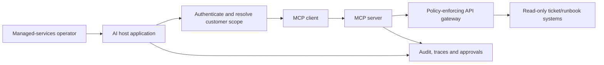

# Model Context Protocol in Managed-Service Environments

## What you will learn

What MCP standardizes, how it differs from an agent framework, and how to expose enterprise capabilities without widening customer-data risk.

## The integration problem

Without a shared protocol, every AI application builds bespoke adapters for ticketing, runbooks, inventory, repositories, and observability systems. Those adapters duplicate authentication, schemas, audit logic, and client work. **Model Context Protocol (MCP)** defines a common client-server protocol for exposing contextual capabilities to an AI application.

MCP is not a model, an identity system, an authorization policy, or an agent framework. It is an integration protocol. The host application remains responsible for selecting and governing what the model can use.

## Core concepts

| Component | Responsibility |
|---|---|
| Host | The AI application that manages user interaction and MCP connections. |
| Client | A host-side connection to one MCP server. |
| Server | Exposes capabilities to clients. |
| Tools | Executable functions; a model/application may select them. |
| Resources | Contextual data made available to the client. |
| Prompts | Reusable templates generally invoked through user/application choice. |

The protocol has a JSON-RPC data layer and transports such as local standard I/O and Streamable HTTP. Capability negotiation establishes what both sides support. Treat every server as an external dependency with its own trust boundary.

1. The host authenticates the operator and derives customer/account scope.
2. The host connects through an MCP client to a trusted, allowlisted server.
3. A requested tool call is validated by the MCP server and its downstream policy gateway.
4. The downstream system authorizes the call; it must not trust claimed scope from a prompt.
5. The result returns with source metadata; host and server log the action without leaking secrets.

## Example: scoped ticket and runbook server

Expose two read-only capabilities: `get_change_ticket(ticket_id)` and `get_approved_runbook(service, symptom)`. The server derives allowable customer IDs from the caller’s token, rejects unassigned tickets, strips secrets from results, and emits a correlated audit event. The assistant can summarize evidence but cannot create, update, or approve changes through this server.

For a remote server, use a dedicated service identity, short-lived user/delegated credentials where feasible, TLS, token audience validation, rate limits, and network egress controls. Keep server credentials separate from the host. For a local server, standard I/O reduces network exposure but the local host process is still a trust boundary.

## MCP versus direct tools

Direct function calling is often simplest when one application owns a small set of internal APIs. MCP becomes compelling when several hosts need a consistent, discoverable integration. In either design, business authorization belongs behind the tool boundary. An MCP server does not make an unsafe API safe.

## Threats and mitigations

| Risk | Control |
|---|---|
| Malicious tool description or resource text | Treat metadata/content as untrusted; allowlist servers and review changes. |
| Over-broad tool credentials | Narrow server roles; authorize every call against caller scope. |
| Indirect prompt injection | Separate data from instructions; restrict tool chains and sensitive actions. |
| Supply-chain compromise | Pin/review dependencies, verify provenance, isolate runtime, monitor egress. |
| Data exposure in telemetry | Minimize retained content and redact secrets/identifiers. |

## Key takeaways

- MCP standardizes AI-application integration; it does not remove security or operational design work.
- The host/application controls connections and should preserve user intent and customer scope.
- Put authorization, validation, and auditing at the server/API boundary.

## Production readiness checklist

- [ ] Servers and versions are allowlisted and reviewed.
- [ ] Each capability has explicit input/output schemas and least privilege.
- [ ] Customer scope is verified downstream, not merely included in text.
- [ ] Remote transport has authenticated, encrypted, observable connectivity.
- [ ] Destructive actions use separate approved workflows.

## Further reading

- [MCP architecture overview](https://modelcontextprotocol.io/docs/learn/architecture)
- [MCP server primitives specification](https://modelcontextprotocol.io/specification/2025-06-18/server/index)
