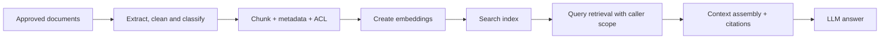
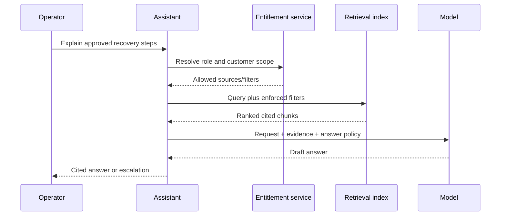

# Retrieval-Augmented Generation for Managed-Service Knowledge

## What you will learn

How RAG grounds answers in approved knowledge, how access controls survive retrieval, and how to evaluate the system as both search and generation.

## The production problem

Runbooks, service procedures, customer documents, and policies change faster than a model’s training data. RAG retrieves relevant authorized content at request time and gives it to the model as evidence. It does not “teach” the model permanently, and it cannot guarantee a correct answer.

The ingestion boundary is where documents are classified, versioned, and assigned ownership/retention. The query boundary is where the caller’s customer, team, and entitlement filters are enforced before any chunk reaches the model.

## How retrieval works

Documents are split into useful passages (**chunks**) and enriched with metadata: source, version, service, customer scope, classification, and ACL. An embedding model converts each chunk into a vector: a numerical representation that lets search find semantically similar content. At runtime, the query is embedded, matching chunks are retrieved (often with keyword/hybrid search and reranking), then selected evidence is inserted into the model context.

Chunking is an engineering choice. A 200-page runbook as one chunk is too coarse; sentence fragments lose procedure context. Chunk by logical sections, preserve headings and source links, test overlaps, and retain enough context to interpret an instruction safely.

## Example: customer operations knowledge assistant

The assistant must return the document/version used and say when it cannot find sufficient evidence. It should not convert a retrieved runbook into permission to execute steps. Ingestion changes trigger controlled re-indexing; deleted or revoked documents must be removed from search and caches.

## Choosing an implementation approach

A managed knowledge-base service reduces ingestion and retrieval operations. A custom pipeline provides control over chunking, parsers, ACL semantics, reranking, and evaluation. On AWS, options can include managed Bedrock Knowledge Bases or a custom design using OpenSearch vector/hybrid search or Aurora PostgreSQL with pgvector. Choose based on existing data stores, latency, customization, operational ownership, and permission model—not fashion.

## RAG versus alternatives

| Need | Usually prefer |
|---|---|
| Current/private sources with citations | RAG |
| Stable behavior or style across tasks | Prompting, then possibly fine-tuning |
| Exact deterministic procedure | Conventional application/workflow |
| Live system state | Controlled read-only tool/API |

Fine-tuning changes model behavior; it is not a straightforward replacement for current source retrieval. Do not put private documents into fine-tuning merely to make them searchable.

## Quality and failure modes

- Measure retrieval recall/precision separately from answer relevance and faithfulness.
- Test permission leakage with adversarial cross-customer queries.
- Detect stale content with source versioning, ingestion SLAs, and deletion propagation.
- Mitigate irrelevant retrieval with metadata filters, hybrid retrieval, reranking, and context limits.
- Defend against malicious document instructions: retrieved content is evidence, never controlling policy.

## Key takeaways

- RAG is a governed retrieval system attached to generation.
- ACL-aware retrieval and citations are core features, not polish.
- Evaluate indexing, retrieval, and generation independently.

## Production readiness checklist

- [ ] Sources have owners, classifications, versions, and deletion processes.
- [ ] Filters enforce caller/customer scope before context assembly.
- [ ] Answer output includes traceable citations and an insufficient-evidence path.
- [ ] Retrieval and grounded-answer evaluations run on representative test sets.
- [ ] Ingestion, retrieval, and model events are observable and auditable.

## Further reading

- [How Amazon Bedrock Knowledge Bases works](https://docs.aws.amazon.com/bedrock/latest/userguide/kb-how-it-works.html)
- [AWS guidance for selecting RAG approaches](https://docs.aws.amazon.com/prescriptive-guidance/latest/retrieval-augmented-generation-options/choosing-option.html)
